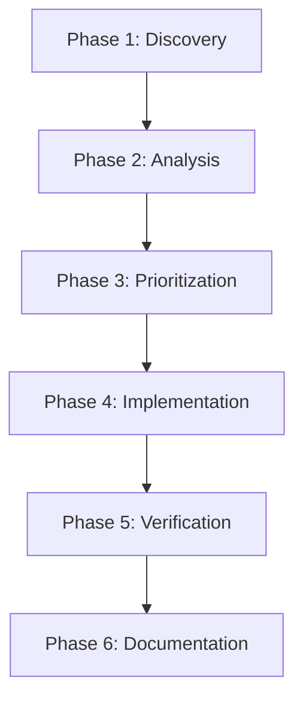

# Design Document: Comprehensive Platform Audit & Optimization

## Overview

This design outlines a systematic approach to auditing the entire St. Haroon Online School platform, identifying issues across frontend, backend, database, APIs, authentication, payments, UI/UX, security, performance, and deployment. The audit will produce a prioritized action plan with fixes, optimizations, and enhancements.

## Architecture

### Audit Phases



### Audit Scope

1. **Frontend Layer**
   - React components (200+)
   - UI/UX consistency
   - Accessibility compliance
   - Performance metrics
   - Responsive design

2. **Backend Layer**
   - API routes (150+)
   - Authentication/Authorization
   - Input validation
   - Error handling
   - Rate limiting

3. **Database Layer**
   - Schema integrity
   - RLS policies
   - Indexes and performance
   - Data consistency
   - Backup procedures

4. **Integration Layer**
   - Payment gateways (Stripe, PayPal, Razorpay)
   - Live classes (Zoom, Google Meet)
   - Email service (Resend)
   - AI chatbot (Gemini)
   - Push notifications

5. **Security Layer**
   - Authentication flows
   - Authorization checks
   - Input sanitization
   - CSP headers
   - API key management

6. **Performance Layer**
   - Core Web Vitals
   - Bundle size
   - Database query optimization
   - Caching strategy
   - CDN usage

## Components and Interfaces

### 1. Audit Engine

```typescript
interface AuditEngine {
  runAudit(scope: AuditScope): Promise<AuditReport>
  analyzeResults(report: AuditReport): AnalysisResult
  generateActionPlan(analysis: AnalysisResult): ActionPlan
}

interface AuditScope {
  frontend: boolean
  backend: boolean
  database: boolean
  integrations: boolean
  security: boolean
  performance: boolean
}

interface AuditReport {
  timestamp: Date
  scope: AuditScope
  findings: Finding[]
  metrics: Metrics
  summary: Summary
}

interface Finding {
  id: string
  category: Category
  severity: 'critical' | 'high' | 'medium' | 'low'
  title: string
  description: string
  location: string
  recommendation: string
  effort: 'small' | 'medium' | 'large'
}
```

### 2. Issue Tracker

```typescript
interface IssueTracker {
  categorizeIssues(findings: Finding[]): CategorizedIssues
  prioritizeIssues(issues: CategorizedIssues): PrioritizedIssues
  assignOwners(issues: PrioritizedIssues): AssignedIssues
}

interface CategorizedIssues {
  broken: Finding[]        // Non-functional features
  incomplete: Finding[]    // Partially implemented features
  missing: Finding[]       // Planned but not implemented
  optimization: Finding[]  // Working but can be improved
  security: Finding[]      // Security vulnerabilities
  performance: Finding[]   // Performance bottlenecks
}
```

### 3. Fix Implementer

```typescript
interface FixImplementer {
  applyFix(issue: Finding): Promise<FixResult>
  testFix(result: FixResult): Promise<TestResult>
  documentFix(result: FixResult): Promise<Documentation>
}

interface FixResult {
  issueId: string
  status: 'success' | 'partial' | 'failed'
  filesModified: string[]
  testsAdded: string[]
  notes: string
}
```

## Data Models

### Audit Finding

```typescript
interface AuditFinding {
  id: string
  timestamp: Date
  category: 'frontend' | 'backend' | 'database' | 'integration' | 'security' | 'performance'
  severity: 'critical' | 'high' | 'medium' | 'low'
  status: 'open' | 'in_progress' | 'fixed' | 'wont_fix'
  title: string
  description: string
  location: {
    file: string
    line?: number
    function?: string
  }
  impact: string
  recommendation: string
  effort: 'small' | 'medium' | 'large'
  assignee?: string
  fixedAt?: Date
  verifiedAt?: Date
}
```

### Performance Metrics

```typescript
interface PerformanceMetrics {
  coreWebVitals: {
    lcp: number  // Largest Contentful Paint
    fid: number  // First Input Delay
    cls: number  // Cumulative Layout Shift
  }
  buildMetrics: {
    buildTime: number
    bundleSize: number
    chunkSizes: Record<string, number>
  }
  apiMetrics: {
    averageResponseTime: number
    p95ResponseTime: number
    errorRate: number
  }
  databaseMetrics: {
    queryCount: number
    slowQueries: number
    averageQueryTime: number
  }
}
```

## Correctness Properties

*A property is a characteristic or behavior that should hold true across all valid executions of a system-essentially, a formal statement about what the system should do. Properties serve as the bridge between human-readable specifications and machine-verifiable correctness guarantees.*

### Property 1: API Authentication Consistency

*For any* protected API endpoint, when called without valid authentication, the system should return a 401 Unauthorized response and not execute the endpoint logic.

**Validates: Requirements 2.1, 4.5**

### Property 2: RLS Policy Enforcement

*For any* database query, when executed by a user, the system should only return records that the user is authorized to access according to their role.

**Validates: Requirements 3.2, 4.5**

### Property 3: Input Validation Completeness

*For any* API endpoint accepting user input, when invalid data is submitted, the system should reject the request with a 400 Bad Request and descriptive error message before processing.

**Validates: Requirements 2.2, 9.3**

### Property 4: Payment Transaction Atomicity

*For any* payment transaction, when processing fails at any step, the system should roll back all related database changes and not charge the user.

**Validates: Requirements 5.1, 5.4**

### Property 5: Accessibility Keyboard Navigation

*For any* interactive UI element, when using only keyboard navigation, the element should be reachable and operable without requiring a mouse.

**Validates: Requirements 8.2**

### Property 6: Error Logging Completeness

*For any* API error, when an exception occurs, the system should log the error with sufficient context (user ID, request details, stack trace) for debugging.

**Validates: Requirements 2.3**

### Property 7: Rate Limiting Enforcement

*For any* API endpoint with rate limiting, when the limit is exceeded, the system should return a 429 Too Many Requests response and not process the request.

**Validates: Requirements 2.4, 9.4**

### Property 8: Session Expiration Handling

*For any* authenticated session, when the session expires, the system should redirect the user to login and clear all session data.

**Validates: Requirements 4.1**

### Property 9: Email Delivery Reliability

*For any* email notification, when sent, the system should either successfully deliver the email or log the failure with retry information.

**Validates: Requirements 7.1**

### Property 10: File Upload Validation

*For any* file upload, when a file is submitted, the system should validate file type, size, and content before storing.

**Validates: Requirements 9.2**

### Property 11: Database Index Effectiveness

*For any* frequently executed query, when an appropriate index exists, the query execution time should be significantly faster than without the index.

**Validates: Requirements 3.1**

### Property 12: Responsive Layout Integrity

*For any* page layout, when viewed at different viewport widths (320px to 1920px), all content should remain accessible and readable without horizontal scrolling.

**Validates: Requirements 1.4**

### Property 13: ARIA Label Completeness

*For any* interactive element without visible text, when inspected, the element should have an appropriate ARIA label or accessible name.

**Validates: Requirements 8.1**

### Property 14: API Response Consistency

*For any* API endpoint, when called successfully, the response should follow the standard format with consistent field names and data types.

**Validates: Requirements 2.5**

### Property 15: Test Coverage Adequacy

*For any* critical business logic function, when tests are run, the function should have at least 80% code coverage including edge cases.

**Validates: Requirements 11.1**

## Error Handling

### Error Categories

1. **Build Errors**
   - TypeScript compilation errors
   - Linting errors
   - Missing dependencies
   - Configuration errors

2. **Runtime Errors**
   - Unhandled exceptions
   - Promise rejections
   - Network failures
   - Database connection errors

3. **User Errors**
   - Invalid input
   - Unauthorized access
   - Resource not found
   - Quota exceeded

4. **Integration Errors**
   - Payment gateway failures
   - Email delivery failures
   - API rate limit exceeded
   - Third-party service downtime

### Error Handling Strategy

```typescript
interface ErrorHandler {
  // Categorize error
  categorize(error: Error): ErrorCategory
  
  // Log error with context
  log(error: Error, context: ErrorContext): void
  
  // Determine if error is recoverable
  isRecoverable(error: Error): boolean
  
  // Attempt recovery
  recover(error: Error): Promise<RecoveryResult>
  
  // Notify appropriate parties
  notify(error: Error, severity: Severity): void
}

interface ErrorContext {
  userId?: string
  requestId: string
  endpoint: string
  timestamp: Date
  environment: 'development' | 'staging' | 'production'
  additionalData: Record<string, any>
}
```

## Testing Strategy

### Unit Testing

- Test individual functions and components in isolation
- Mock external dependencies
- Focus on business logic and edge cases
- Target: 80% code coverage for critical paths

### Integration Testing

- Test API endpoints end-to-end
- Test database operations with real database
- Test authentication and authorization flows
- Test payment processing workflows

### Property-Based Testing

- Use Fast-check to generate random test inputs
- Test universal properties across all inputs
- Discover edge cases automatically
- Validate correctness properties defined above

### Accessibility Testing

- Use axe-core for automated WCAG checks
- Manual keyboard navigation testing
- Screen reader compatibility testing
- Color contrast verification

### Performance Testing

- Lighthouse CI for Core Web Vitals
- Load testing for API endpoints
- Database query performance profiling
- Bundle size monitoring

### Security Testing

- OWASP ZAP for vulnerability scanning
- Dependency vulnerability scanning (npm audit)
- Manual penetration testing
- Code review for security issues

## Implementation Phases

### Phase 1: Discovery & Assessment (Week 1)

**Objectives:**
- Run automated audits
- Identify all issues
- Categorize findings
- Measure current metrics

**Deliverables:**
- Comprehensive audit report
- Issue database
- Baseline metrics
- Priority matrix

### Phase 2: Critical Fixes (Week 2)

**Focus:** Critical and high-severity issues

**Categories:**
- Security vulnerabilities
- Broken functionality
- Data integrity issues
- Authentication/authorization bugs

**Success Criteria:**
- All critical issues resolved
- All high-severity issues resolved
- Security scan passes
- Core user flows working

### Phase 3: Feature Completion (Week 3)

**Focus:** Incomplete and missing features

**Categories:**
- TODO implementations
- Mock data replacement
- Placeholder function completion
- Integration finalization

**Success Criteria:**
- All TODOs addressed
- All features functional
- All integrations tested
- Documentation updated

### Phase 4: Optimization (Week 4)

**Focus:** Performance and UX improvements

**Categories:**
- Performance optimization
- Accessibility enhancements
- UI/UX polish
- Code refactoring

**Success Criteria:**
- Core Web Vitals in "Good" range
- WCAG 2.1 AA compliance
- Lighthouse score > 90
- Code quality metrics improved

### Phase 5: Testing & Documentation (Week 5)

**Focus:** Comprehensive testing and documentation

**Categories:**
- Test coverage improvement
- Documentation completion
- Deployment procedures
- Monitoring setup

**Success Criteria:**
- 80% test coverage
- All APIs documented
- Deployment guide tested
- Monitoring active

### Phase 6: Production Readiness (Week 6)

**Focus:** Final verification and launch preparation

**Categories:**
- End-to-end testing
- Load testing
- Security audit
- Backup verification

**Success Criteria:**
- All tests passing
- Performance acceptable
- Security hardened
- Backup tested
- Monitoring configured
- Documentation complete

## Monitoring and Maintenance

### Error Tracking

- Integrate Sentry for error tracking
- Set up error alerts
- Create error dashboard
- Define SLAs for error resolution

### Performance Monitoring

- Enable Vercel Analytics
- Set up custom performance metrics
- Create performance dashboard
- Define performance budgets

### Uptime Monitoring

- Configure uptime monitoring service
- Set up status page
- Define incident response procedures
- Create runbooks for common issues

### Security Monitoring

- Enable security scanning
- Set up vulnerability alerts
- Schedule regular security audits
- Maintain security changelog

## Success Metrics

### Technical Metrics

- Build success rate: 100%
- Test pass rate: 100%
- Code coverage: > 80%
- TypeScript strict mode: Enabled
- Linting errors: 0
- Security vulnerabilities: 0 critical, 0 high

### Performance Metrics

- Lighthouse Performance: > 90
- Lighthouse Accessibility: > 95
- Lighthouse Best Practices: > 95
- Lighthouse SEO: > 90
- LCP: < 2.5s
- FID: < 100ms
- CLS: < 0.1

### User Experience Metrics

- Page load time: < 3s
- API response time: < 500ms
- Error rate: < 0.1%
- Uptime: > 99.9%

### Business Metrics

- Payment success rate: > 95%
- Email delivery rate: > 98%
- User satisfaction: > 4.5/5
- Support ticket volume: Decreasing

## Risk Mitigation

### Technical Risks

1. **Breaking Changes**
   - Risk: Fixes introduce new bugs
   - Mitigation: Comprehensive testing, staged rollout

2. **Performance Degradation**
   - Risk: Optimizations slow down other areas
   - Mitigation: Performance monitoring, benchmarking

3. **Data Loss**
   - Risk: Database changes cause data loss
   - Mitigation: Backups before changes, migration testing

### Business Risks

1. **Downtime**
   - Risk: Deployment causes outage
   - Mitigation: Blue-green deployment, rollback plan

2. **User Disruption**
   - Risk: Changes confuse users
   - Mitigation: User communication, gradual rollout

3. **Cost Overruns**
   - Risk: Fixes take longer than estimated
   - Mitigation: Time-boxing, prioritization

## Deployment Strategy

### Staging Environment

- Deploy all changes to staging first
- Run full test suite
- Manual QA testing
- Performance testing
- Security scanning

### Production Deployment

- Use Vercel preview deployments
- Gradual rollout (10% → 50% → 100%)
- Monitor error rates
- Monitor performance metrics
- Rollback plan ready

### Rollback Procedures

1. Identify issue
2. Assess severity
3. Execute rollback if critical
4. Investigate root cause
5. Fix and redeploy

## Documentation Deliverables

### Technical Documentation

- Architecture diagrams
- API reference
- Database schema documentation
- Deployment procedures
- Troubleshooting guides

### User Documentation

- User guides for all roles
- Feature tutorials
- FAQ
- Video walkthroughs
- Quick reference cards

### Operational Documentation

- Runbooks for common issues
- Incident response procedures
- Backup and recovery procedures
- Monitoring and alerting setup
- Security procedures

## Conclusion

This comprehensive audit and optimization effort will transform the St. Haroon Online School platform from a feature-complete system to a production-ready, enterprise-grade learning management system. By systematically addressing issues across all layers, implementing robust testing, and establishing monitoring and maintenance procedures, we ensure the platform is secure, performant, accessible, and reliable for all users.
