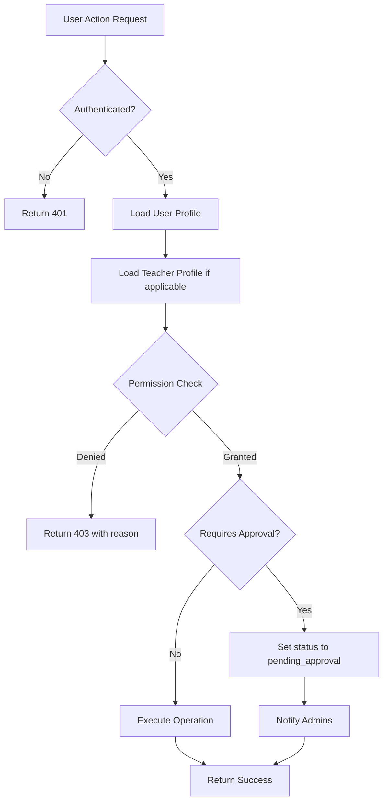

# Design Document

## Overview

The Hierarchical Role-Based Access Control (RBAC) System introduces a five-level permission hierarchy that replaces the current flat role structure. This system provides granular control over course management operations, implements an approval workflow for lower-level teachers, and enables administrators to assign teachers to specific grades and subjects.

The design follows a layered architecture with clear separation between permission logic, business logic, and presentation layers. The system integrates seamlessly with the existing notification infrastructure and maintains backward compatibility with current user roles.

## Architecture

### System Layers

```
┌─────────────────────────────────────────────────────────┐
│                    Presentation Layer                    │
│  (UI Components, Pages, Status Badges, Approval Forms)  │
└─────────────────────────────────────────────────────────┘
                            ↓
┌─────────────────────────────────────────────────────────┐
│                      API Layer                           │
│     (Route Handlers, Request Validation, Response)      │
└─────────────────────────────────────────────────────────┘
                            ↓
┌─────────────────────────────────────────────────────────┐
│                  Permission Middleware                   │
│  (Authorization Checks, Role Validation, Scope Checks)  │
└─────────────────────────────────────────────────────────┘
                            ↓
┌─────────────────────────────────────────────────────────┐
│                   Business Logic Layer                   │
│   (Course Operations, Approval Workflow, Assignments)   │
└─────────────────────────────────────────────────────────┘
                            ↓
┌─────────────────────────────────────────────────────────┐
│                     Data Access Layer                    │
│        (Database Queries, RLS Policies, Triggers)       │
└─────────────────────────────────────────────────────────┘
```

### Permission Flow



## Components and Interfaces

### 1. Permission Checking Module

**Location:** `lib/permissions/coursePermissions.ts`

```typescript
interface PermissionContext {
  user: User;
  teacher?: Teacher;
  course?: Course;
  action: CourseAction;
}

interface PermissionResult {
  allowed: boolean;
  reason?: string;
  requiresApproval?: boolean;
}

enum CourseAction {
  CREATE = 'create',
  EDIT = 'edit',
  DELETE = 'delete',
  PUBLISH = 'publish',
  MANAGE_CONTENT = 'manage_content',
  CREATE_MEETING = 'create_meeting'
}

// Core permission functions
function canCreateCourse(context: PermissionContext): PermissionResult
function canEditCourse(context: PermissionContext): PermissionResult
function canDeleteCourse(context: PermissionContext): PermissionResult
function canPublishCourse(context: PermissionContext): PermissionResult
function canManageCourseContent(context: PermissionContext): PermissionResult
function isAssignedToClass(teacher: Teacher, courseGrade: string): boolean
function isAssignedToSubject(teacher: Teacher, courseSubject: string): boolean
```

### 2. Approval Workflow Module

**Location:** `lib/workflows/courseApproval.ts`

```typescript
interface ApprovalRequest {
  courseId: string;
  teacherId: string;
  submittedAt: Date;
  status: ApprovalStatus;
}

enum ApprovalStatus {
  DRAFT = 'draft',
  PENDING_APPROVAL = 'pending_approval',
  APPROVED = 'approved',
  REJECTED = 'rejected'
}

interface ApprovalAction {
  courseId: string;
  adminId: string;
  action: 'approve' | 'reject' | 'request_changes';
  reason?: string;
  feedback?: string;
}

function submitForApproval(courseId: string, teacherId: string): Promise<void>
function approveCourse(action: ApprovalAction): Promise<void>
function rejectCourse(action: ApprovalAction): Promise<void>
function requestChanges(action: ApprovalAction): Promise<void>
```

### 3. Teacher Assignment Module

**Location:** `lib/admin/teacherAssignments.ts`

```typescript
interface TeacherAssignment {
  teacherId: string;
  teacherType: TeacherType;
  assignedGrades: string[];
  assignedSubjects: string[];
  canCreateCourses: boolean;
  requiresCourseApproval: boolean;
  department?: string;
}

enum TeacherType {
  TUITION_TEACHER = 'tuition_teacher',
  COURSE_TEACHER = 'course_teacher',
  SENIOR_TEACHER = 'senior_teacher'
}

function assignTeacherToGrades(teacherId: string, grades: string[]): Promise<void>
function assignTeacherToSubjects(teacherId: string, subjects: string[]): Promise<void>
function updateTeacherType(teacherId: string, type: TeacherType): Promise<void>
function setApprovalRequirement(teacherId: string, required: boolean): Promise<void>
```

### 4. Notification Integration

**Location:** `lib/notifications/approvalNotifications.ts`

```typescript
interface ApprovalNotification {
  type: NotificationType;
  recipientIds: string[];
  courseId: string;
  teacherId?: string;
  adminId?: string;
  reason?: string;
}

enum NotificationType {
  COURSE_SUBMITTED = 'course_submitted',
  COURSE_APPROVED = 'course_approved',
  COURSE_REJECTED = 'course_rejected',
  CHANGES_REQUESTED = 'changes_requested'
}

function notifyAdminsOfSubmission(courseId: string, teacherId: string): Promise<void>
function notifyTeacherOfApproval(courseId: string, teacherId: string): Promise<void>
function notifyTeacherOfRejection(courseId: string, teacherId: string, reason: string): Promise<void>
function notifyTeacherOfChanges(courseId: string, teacherId: string, feedback: string): Promise<void>
```

## Data Models

### Database Schema Updates

#### Users Table Extensions

```sql
ALTER TABLE users 
ADD COLUMN role_level INTEGER DEFAULT 1 CHECK (role_level BETWEEN 1 AND 5),
ADD COLUMN can_approve_courses BOOLEAN DEFAULT FALSE,
ADD COLUMN department TEXT;

COMMENT ON COLUMN users.role_level IS 'Hierarchical role level: 1=Tuition Teacher, 2=Course Teacher, 3=Senior Teacher, 4=Admin, 5=Super Admin';
COMMENT ON COLUMN users.can_approve_courses IS 'Whether user can approve course submissions from lower-level teachers';
COMMENT ON COLUMN users.department IS 'Department or subject area the user belongs to';

CREATE INDEX idx_users_role_level ON users(role_level);
CREATE INDEX idx_users_can_approve ON users(can_approve_courses) WHERE can_approve_courses = TRUE;
```

#### Teachers Table Extensions

```sql
ALTER TABLE teachers
ADD COLUMN teacher_type TEXT CHECK (teacher_type IN ('tuition_teacher', 'course_teacher', 'senior_teacher')),
ADD COLUMN assigned_grades TEXT[] DEFAULT '{}',
ADD COLUMN assigned_subjects TEXT[] DEFAULT '{}',
ADD COLUMN can_create_courses BOOLEAN DEFAULT TRUE,
ADD COLUMN requires_course_approval BOOLEAN DEFAULT TRUE;

COMMENT ON COLUMN teachers.teacher_type IS 'Type of teacher determining base permissions';
COMMENT ON COLUMN teachers.assigned_grades IS 'Array of grade levels teacher is authorized for (e.g., [''1'', ''2'', ''3''])';
COMMENT ON COLUMN teachers.assigned_subjects IS 'Array of subjects teacher is authorized for (e.g., [''mathematics'', ''science''])';
COMMENT ON COLUMN teachers.can_create_courses IS 'Whether teacher has permission to create courses';
COMMENT ON COLUMN teachers.requires_course_approval IS 'Whether teacher courses need admin approval before publishing';

CREATE INDEX idx_teachers_type ON teachers(teacher_type);
CREATE INDEX idx_teachers_grades ON teachers USING GIN(assigned_grades);
CREATE INDEX idx_teachers_subjects ON teachers USING GIN(assigned_subjects);
```

#### Courses Table Extensions

```sql
ALTER TABLE courses
ADD COLUMN created_by_role TEXT CHECK (created_by_role IN ('super_admin', 'admin', 'senior_teacher', 'course_teacher', 'tuition_teacher')),
ADD COLUMN approval_status TEXT DEFAULT 'draft' CHECK (approval_status IN ('draft', 'pending_approval', 'approved', 'rejected')),
ADD COLUMN approved_by UUID REFERENCES users(id),
ADD COLUMN approved_at TIMESTAMP WITH TIME ZONE,
ADD COLUMN rejection_reason TEXT,
ADD COLUMN submission_notes TEXT;

COMMENT ON COLUMN courses.created_by_role IS 'Role level of the user who created the course';
COMMENT ON COLUMN courses.approval_status IS 'Current approval workflow status';
COMMENT ON COLUMN courses.approved_by IS 'Admin who approved the course';
COMMENT ON COLUMN courses.approved_at IS 'Timestamp when course was approved';
COMMENT ON COLUMN courses.rejection_reason IS 'Reason provided when course was rejected';
COMMENT ON COLUMN courses.submission_notes IS 'Notes from teacher when submitting for approval';

CREATE INDEX idx_courses_approval_status ON courses(approval_status);
CREATE INDEX idx_courses_created_by_role ON courses(created_by_role);
CREATE INDEX idx_courses_pending_approval ON courses(approval_status) WHERE approval_status = 'pending_approval';
```

#### Course Approval History Table (New)

```sql
CREATE TABLE course_approval_history (
  id UUID PRIMARY KEY DEFAULT uuid_generate_v4(),
  course_id UUID NOT NULL REFERENCES courses(id) ON DELETE CASCADE,
  action TEXT NOT NULL CHECK (action IN ('submitted', 'approved', 'rejected', 'changes_requested', 'resubmitted')),
  performed_by UUID NOT NULL REFERENCES users(id),
  performed_at TIMESTAMP WITH TIME ZONE DEFAULT NOW(),
  reason TEXT,
  feedback TEXT,
  previous_status TEXT,
  new_status TEXT
);

CREATE INDEX idx_approval_history_course ON course_approval_history(course_id);
CREATE INDEX idx_approval_history_performed_at ON course_approval_history(performed_at DESC);

COMMENT ON TABLE course_approval_history IS 'Audit trail of all course approval workflow actions';
```

### TypeScript Type Definitions

```typescript
// User role levels
type RoleLevel = 1 | 2 | 3 | 4 | 5;

interface User {
  id: string;
  email: string;
  role: 'admin' | 'teacher' | 'student' | 'parent';
  role_level: RoleLevel;
  can_approve_courses: boolean;
  department?: string;
  // ... existing fields
}

interface Teacher {
  id: string;
  user_id: string;
  teacher_type: 'tuition_teacher' | 'course_teacher' | 'senior_teacher';
  assigned_grades: string[];
  assigned_subjects: string[];
  can_create_courses: boolean;
  requires_course_approval: boolean;
  // ... existing fields
}

interface Course {
  id: string;
  title: string;
  created_by: string;
  created_by_role: 'super_admin' | 'admin' | 'senior_teacher' | 'course_teacher' | 'tuition_teacher';
  approval_status: 'draft' | 'pending_approval' | 'approved' | 'rejected';
  approved_by?: string;
  approved_at?: Date;
  rejection_reason?: string;
  submission_notes?: string;
  // ... existing fields
}
```

## Correctness Properties

*A property is a characteristic or behavior that should hold true across all valid executions of a system-essentially, a formal statement about what the system should do. Properties serve as the bridge between human-readable specifications and machine-verifiable correctness guarantees.*

### Acceptance Criteria Testing Prework

1.1 WHEN a user account is created THEN the System SHALL assign a default role level of 1
Thoughts: This is about default values when creating user accounts. For any new user account, the role_level should be 1 unless explicitly set otherwise.
Testable: yes - property

1.2 WHEN an administrator updates a user's role level THEN the System SHALL validate the new level is between 1 and 5
Thoughts: This is input validation that should apply to all role level updates. For any role level update, the value must be in the range [1, 5].
Testable: yes - property

3.1 WHEN a teacher creates a course THEN the System SHALL verify the teacher has can_create_courses permission
Thoughts: This is a permission check that must happen for all course creation attempts. For any teacher attempting to create a course, their can_create_courses flag must be true.
Testable: yes - property

3.2 WHEN a course_teacher or tuition_teacher creates a course THEN the System SHALL set approval_status to 'pending_approval'
Thoughts: This is about automatic status assignment based on teacher type. For any course created by a teacher with requires_course_approval=true, the status should be 'pending_approval'.
Testable: yes - property

3.5 WHEN a teacher attempts to create a course outside assigned grades or subjects THEN the System SHALL reject the creation request
Thoughts: This is scope validation that should apply to all course creation attempts. For any teacher with assigned_grades or assigned_subjects, course creation should only succeed if the course matches their assignments.
Testable: yes - property

4.1 WHEN a teacher attempts to edit a course THEN the System SHALL verify the teacher owns the course OR has permission to edit any course
Thoughts: This is an authorization check that applies to all edit attempts. For any edit request, either ownership or elevated permissions must be verified.
Testable: yes - property

5.3 WHEN a senior_teacher attempts to delete a published course THEN the System SHALL deny the deletion
Thoughts: This is a specific permission restriction. For any senior teacher attempting to delete a course with status='published', the operation should be denied.
Testable: yes - property

5.4 WHEN a course_teacher or tuition_teacher deletes their own draft course THEN the System SHALL allow the deletion
Thoughts: This is a permission rule combining ownership and status checks. For any lower-level teacher deleting their own course, it should only succeed if status='draft'.
Testable: yes - property

6.3 WHEN a course_teacher or tuition_teacher attempts to publish a course THEN the System SHALL set approval_status to 'pending_approval' instead
Thoughts: This is about workflow enforcement. For any publish attempt by a teacher requiring approval, the system should transition to pending_approval rather than published.
Testable: yes - property

7.2 WHEN an administrator approves a course THEN the System SHALL set approval_status to 'approved' and record approved_by and approved_at
Thoughts: This is about state transitions and audit trail. For any approval action, multiple fields must be updated atomically.
Testable: yes - property

7.3 WHEN an administrator rejects a course THEN the System SHALL set approval_status to 'rejected' and store the rejection_reason
Thoughts: This is about rejection workflow. For any rejection, both status and reason must be recorded.
Testable: yes - property

13.1 WHEN any course operation is requested THEN the System SHALL execute permission validation before processing
Thoughts: This is about the order of operations. For any course operation, permission checks must occur before the actual operation.
Testable: yes - property

13.2 WHEN permission validation fails THEN the System SHALL return a 403 Forbidden error with a descriptive message
Thoughts: This is about error handling consistency. For any failed permission check, the response should be 403 with a message.
Testable: yes - property

### Property Reflection

After reviewing all properties, the following observations:
- Properties 3.2 and 6.3 both test the same behavior (setting pending_approval for lower-level teachers) but from different angles. These can be combined.
- Properties 5.3 and 5.4 test complementary deletion rules and should remain separate as they validate different permission levels.
- Property 7.2 and 7.3 test different workflow transitions and should remain separate.
- All other properties test unique aspects of the permission system.

### Correctness Properties

Property 1: Default role level assignment
*For any* newly created user account, the role_level field should be set to 1 unless explicitly specified otherwise
**Validates: Requirements 1.1**

Property 2: Role level range validation
*For any* role level update operation, the new value must be an integer between 1 and 5 inclusive
**Validates: Requirements 1.2**

Property 3: Course creation permission check
*For any* teacher attempting to create a course, the operation should only succeed if their can_create_courses flag is true
**Validates: Requirements 3.1**

Property 4: Automatic approval workflow enrollment
*For any* course created by a teacher with requires_course_approval=true, the approval_status should be automatically set to 'pending_approval'
**Validates: Requirements 3.2, 6.3**

Property 5: Assignment scope enforcement
*For any* teacher with non-empty assigned_grades or assigned_subjects arrays, course creation should only succeed if the course's grade and subject match at least one assignment
**Validates: Requirements 3.5**

Property 6: Edit permission verification
*For any* course edit attempt, the operation should only succeed if the teacher either owns the course (created_by = teacher_id) OR has role_level >= 3
**Validates: Requirements 4.1**

Property 7: Published course deletion restriction
*For any* course with approval_status='approved' or status='published', deletion attempts by users with role_level < 4 should be denied
**Validates: Requirements 5.3**

Property 8: Draft course deletion permission
*For any* course with approval_status='draft', deletion should succeed if the user either owns the course OR has role_level >= 4
**Validates: Requirements 5.4**

Property 9: Approval state transition completeness
*For any* course approval action, the system should atomically update approval_status='approved', set approved_by to the admin's ID, and set approved_at to the current timestamp
**Validates: Requirements 7.2**

Property 10: Rejection state transition completeness
*For any* course rejection action, the system should atomically update approval_status='rejected' and store the provided rejection_reason
**Validates: Requirements 7.3**

Property 11: Permission check precedence
*For any* course operation request, permission validation must complete before any database modifications occur
**Validates: Requirements 13.1**

Property 12: Permission denial response format
*For any* failed permission check, the API response should have status code 403 and include a descriptive error message explaining why access was denied
**Validates: Requirements 13.2**

## Error Handling

### Permission Errors

```typescript
class PermissionDeniedError extends Error {
  constructor(
    public action: string,
    public resource: string,
    public reason: string,
    public requiredLevel?: number
  ) {
    super(`Permission denied: ${reason}`);
    this.name = 'PermissionDeniedError';
  }
}

class AssignmentMismatchError extends Error {
  constructor(
    public teacherId: string,
    public courseGrade: string,
    public courseSubject: string
  ) {
    super(`Teacher not assigned to grade ${courseGrade} or subject ${courseSubject}`);
    this.name = 'AssignmentMismatchError';
  }
}
```

### Approval Workflow Errors

```typescript
class InvalidApprovalStateError extends Error {
  constructor(
    public courseId: string,
    public currentStatus: string,
    public attemptedAction: string
  ) {
    super(`Cannot ${attemptedAction} course in ${currentStatus} state`);
    this.name = 'InvalidApprovalStateError';
  }
}
```

### Error Response Format

```typescript
interface ErrorResponse {
  error: {
    code: string;
    message: string;
    details?: Record<string, any>;
    requiredPermission?: string;
    currentPermission?: string;
  };
}
```

## Testing Strategy

### Unit Testing

Unit tests will cover:
- Individual permission check functions with various role combinations
- Assignment validation logic for grades and subjects
- Approval workflow state transitions
- Error handling for invalid inputs
- Database query construction and parameter binding

### Property-Based Testing

The system will use **fast-check** (JavaScript/TypeScript property-based testing library) to verify correctness properties.

Each property-based test will:
- Run a minimum of 100 iterations with randomly generated inputs
- Be tagged with the corresponding correctness property number
- Use the format: `**Feature: hierarchical-rbac-system, Property {number}: {property_text}**`

Example property test structure:

```typescript
import fc from 'fast-check';

describe('**Feature: hierarchical-rbac-system, Property 2: Role level range validation**', () => {
  it('should only accept role levels between 1 and 5', () => {
    fc.assert(
      fc.property(
        fc.integer({ min: 1, max: 5 }),
        (roleLevel) => {
          const result = validateRoleLevel(roleLevel);
          expect(result.valid).toBe(true);
        }
      ),
      { numRuns: 100 }
    );
  });

  it('should reject role levels outside valid range', () => {
    fc.assert(
      fc.property(
        fc.integer().filter(n => n < 1 || n > 5),
        (roleLevel) => {
          const result = validateRoleLevel(roleLevel);
          expect(result.valid).toBe(false);
        }
      ),
      { numRuns: 100 }
    );
  });
});
```

### Integration Testing

Integration tests will verify:
- End-to-end course creation with permission checks
- Approval workflow from submission to approval/rejection
- Notification delivery for workflow events
- Database transaction integrity during state changes
- RLS policy enforcement at the database level

### Test Data Generators

```typescript
// Generate random teacher profiles with various permission levels
const teacherGenerator = fc.record({
  id: fc.uuid(),
  teacher_type: fc.constantFrom('tuition_teacher', 'course_teacher', 'senior_teacher'),
  assigned_grades: fc.array(fc.constantFrom('1', '2', '3', '4', '5', '6', '7', '8', '9', '10', '11', '12')),
  assigned_subjects: fc.array(fc.constantFrom('mathematics', 'science', 'english', 'history')),
  can_create_courses: fc.boolean(),
  requires_course_approval: fc.boolean()
});

// Generate random course data
const courseGenerator = fc.record({
  id: fc.uuid(),
  title: fc.string({ minLength: 5, maxLength: 100 }),
  grade: fc.constantFrom('1', '2', '3', '4', '5', '6', '7', '8', '9', '10', '11', '12'),
  subject: fc.constantFrom('mathematics', 'science', 'english', 'history'),
  approval_status: fc.constantFrom('draft', 'pending_approval', 'approved', 'rejected')
});
```

## Security Considerations

### Row Level Security (RLS) Policies

```sql
-- Teachers can only view courses they created or are assigned to
CREATE POLICY teacher_course_access ON courses
  FOR SELECT
  USING (
    auth.uid() = created_by 
    OR 
    EXISTS (
      SELECT 1 FROM teachers t
      WHERE t.user_id = auth.uid()
      AND (
        courses.grade = ANY(t.assigned_grades)
        OR courses.subject = ANY(t.assigned_subjects)
      )
    )
  );

-- Only admins and senior teachers can view all pending approvals
CREATE POLICY admin_approval_access ON courses
  FOR SELECT
  USING (
    approval_status = 'pending_approval'
    AND EXISTS (
      SELECT 1 FROM users u
      WHERE u.id = auth.uid()
      AND (u.role_level >= 3 OR u.can_approve_courses = TRUE)
    )
  );
```

### API Route Protection

All course management routes will be protected with middleware that:
1. Verifies user authentication
2. Loads user and teacher profiles
3. Executes permission checks before processing
4. Logs all permission decisions for audit

### Input Validation

- All role level updates validated against 1-5 range
- Grade and subject assignments validated against predefined lists
- Course data validated before submission for approval
- Rejection reasons required and sanitized

## Performance Considerations

### Database Indexing

Critical indexes for performance:
- `idx_users_role_level` - Fast role level lookups
- `idx_teachers_grades` (GIN) - Efficient array containment checks
- `idx_teachers_subjects` (GIN) - Efficient array containment checks
- `idx_courses_approval_status` - Fast pending approval queries
- `idx_courses_pending_approval` (partial) - Optimized for approval queue

### Caching Strategy

- User permission profiles cached in Redis with 5-minute TTL
- Teacher assignments cached per session
- Approval queue counts cached and invalidated on status changes
- Permission check results cached for repeated operations within same request

### Query Optimization

- Use prepared statements for permission checks
- Batch load teacher profiles when displaying course lists
- Implement pagination for approval queues
- Use database views for complex permission queries

## Migration Strategy

### Phase 1: Database Schema Updates
1. Add new columns to users, teachers, and courses tables
2. Create course_approval_history table
3. Add indexes for performance
4. Deploy RLS policies

### Phase 2: Data Migration
1. Set default role_level=4 for existing admins
2. Set default role_level=2 for existing teachers
3. Set teacher_type='course_teacher' for all existing teachers
4. Set can_create_courses=true for all existing teachers
5. Set requires_course_approval=false for existing teachers (grandfather clause)

### Phase 3: Code Deployment
1. Deploy permission checking middleware
2. Deploy updated API routes
3. Deploy UI components with status badges
4. Enable notification system integration

### Phase 4: Gradual Rollout
1. Enable for new teachers first
2. Allow existing teachers to opt-in to approval workflow
3. Provide admin tools for bulk teacher assignment
4. Monitor and adjust based on feedback

## Deployment Checklist

- [ ] Database migrations tested in staging
- [ ] RLS policies verified
- [ ] Permission middleware unit tests passing
- [ ] Integration tests passing
- [ ] UI components reviewed
- [ ] Notification templates created
- [ ] Admin documentation updated
- [ ] Teacher onboarding materials prepared
- [ ] Rollback plan documented
- [ ] Monitoring alerts configured
