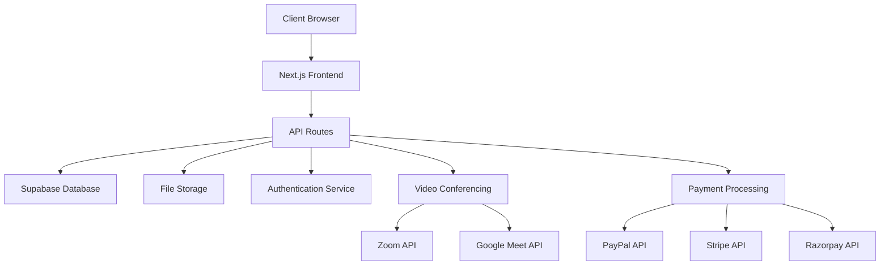

# Design Document - Online Education Platform

## Overview

The Online Education Platform is a comprehensive learning management system built with Next.js 14, TypeScript, and Supabase. The platform provides a multi-tenant architecture supporting students, teachers, parents, and administrators with role-based access control. The system integrates with third-party services for video conferencing (Zoom, Google Meet) and payment processing (PayPal, Stripe, Razorpay).

## Architecture

### System Architecture



### Technology Stack

- **Frontend**: Next.js 14 with App Router, TypeScript, Tailwind CSS
- **Backend**: Next.js API Routes, Server Actions
- **Database**: Supabase (PostgreSQL)
- **Authentication**: Supabase Auth with custom role management
- **File Storage**: Supabase Storage with CDN
- **Real-time**: Supabase Realtime subscriptions
- **Video Conferencing**: Zoom SDK, Google Meet API
- **Payments**: PayPal SDK, Stripe SDK, Razorpay SDK
- **UI Components**: Radix UI, shadcn/ui

## Components and Interfaces

### Core Modules

#### 1. Content Library Module

**Purpose**: Centralized file management system for educational materials

**Components**:
- `FileUploader`: Handles multi-file uploads with progress tracking
- `FileGrid`: Displays files in grid/list view with previews
- `FolderTree`: Hierarchical folder navigation with drag-and-drop
- `FilePreview`: Media-specific preview components (video, audio, document, image)
- `ShareManager`: Generates and manages secure file sharing links

**Key Features**:
- Chunked file uploads for large files
- Real-time upload progress
- File type validation and size limits
- Automatic thumbnail generation
- Secure token-based sharing

#### 2. User Management Module

**Purpose**: User registration, authentication, and role-based access control

**Components**:
- `RegistrationWizard`: Multi-step registration process
- `UserTable`: Administrative user management interface
- `VerificationModal`: Identity document verification
- `BulkActionModal`: Batch user operations
- `UserFilters`: Advanced user search and filtering

**Key Features**:
- Role-based registration flows
- Document upload and verification
- Email verification workflow
- Account suspension and activation
- Bulk user operations

#### 3. Course Management Module

**Purpose**: Course creation, content organization, and student enrollment

**Components**:
- `CourseEditor`: Course creation and editing interface
- `CourseGrid`: Course display with filtering and search
- `CourseAnalytics`: Enrollment and engagement metrics
- `ContentAssignment`: Link content library files to courses
- `StudentProgress`: Track and display learning progress

**Key Features**:
- Drag-and-drop content organization
- Course duplication and templating
- Progress tracking and analytics
- Automated enrollment management
- Grade book integration

#### 4. Live Class Module

**Purpose**: Virtual classroom management with video conferencing integration

**Components**:
- `ClassScheduler`: Schedule and manage live sessions
- `MeetingIntegration`: Zoom/Google Meet API integration
- `AttendanceTracker`: Real-time attendance monitoring
- `RecordingManager`: Automatic recording processing and storage
- `ClassCalendar`: Calendar view of scheduled classes

**Key Features**:
- Automated meeting creation
- Real-time attendance tracking
- Recording processing and storage
- Email/SMS notifications
- Calendar integration

#### 5. Payment Module

**Purpose**: Financial transaction processing and management

**Components**:
- `PaymentGateway`: Multi-gateway payment processing
- `CouponManager`: Discount code creation and validation
- `TransactionHistory`: Payment tracking and reporting
- `InvoiceGenerator`: PDF invoice creation
- `RefundProcessor`: Refund request handling

**Key Features**:
- Multiple payment gateway support
- Coupon code system
- Automated invoice generation
- Refund processing
- Financial reporting and analytics

#### 6. Email Notification Module

**Purpose**: Automated email communication system for transactional and marketing emails

**Components**:
- `EmailService`: Resend API integration for email delivery
- `EmailTemplateEngine`: React Email components for responsive templates
- `EmailQueue`: Job queue system for scheduled and batch email processing
- `EmailScheduler`: Automated email triggers based on platform events
- `EmailAnalytics`: Tracking and reporting for email performance metrics
- `NotificationPreferences`: User settings for email subscription management
- `EmailPreview`: Template testing and preview interface

**Key Features**:
- Beautiful responsive email templates using React Email
- Automated email triggers for platform events
- Scheduled email delivery with retry mechanism
- Bulk email sending with rate limiting
- Email analytics and engagement tracking
- User preference management with unsubscribe handling
- Template preview and testing tools
- Transactional vs marketing email separation

## Data Models

### User Management

```typescript
interface User {
  id: string;
  email: string;
  role: 'student' | 'teacher' | 'parent' | 'admin';
  profile: UserProfile;
  verification_status: 'pending' | 'verified' | 'rejected';
  created_at: string;
  updated_at: string;
}

interface UserProfile {
  first_name: string;
  last_name: string;
  phone: string;
  address: Address;
  category_info?: CategorySpecificInfo;
  documents: VerificationDocument[];
}
```

### Content Library

```typescript
interface File {
  id: string;
  name: string;
  type: string;
  size: number;
  url: string;
  thumbnail_url?: string;
  folder_id?: string;
  uploaded_by: string;
  metadata: FileMetadata;
  created_at: string;
}

interface Folder {
  id: string;
  name: string;
  parent_id?: string;
  created_by: string;
  created_at: string;
}

interface ShareLink {
  id: string;
  file_id: string;
  token: string;
  expires_at: string;
  created_by: string;
}
```

### Course Management

```typescript
interface Course {
  id: string;
  title: string;
  description: string;
  category: string;
  instructor_id: string;
  content_items: ContentItem[];
  enrollment_count: number;
  status: 'draft' | 'published' | 'archived';
  created_at: string;
}

interface ContentItem {
  id: string;
  course_id: string;
  file_id: string;
  order: number;
  title: string;
  description?: string;
}

interface Enrollment {
  id: string;
  student_id: string;
  course_id: string;
  progress: number;
  enrolled_at: string;
}
```

### Live Classes

```typescript
interface LiveClass {
  id: string;
  course_id: string;
  teacher_id: string;
  title: string;
  scheduled_at: string;
  duration: number;
  meeting_url: string;
  meeting_id: string;
  recording_url?: string;
  status: 'scheduled' | 'ongoing' | 'completed' | 'cancelled';
}

interface Attendance {
  id: string;
  class_id: string;
  student_id: string;
  joined_at: string;
  left_at?: string;
  duration: number;
}
```

### Payment System

```typescript
interface Transaction {
  id: string;
  user_id: string;
  course_id: string;
  amount: number;
  currency: string;
  gateway: 'paypal' | 'stripe' | 'razorpay';
  gateway_transaction_id: string;
  status: 'pending' | 'completed' | 'failed' | 'refunded';
  created_at: string;
}

interface Coupon {
  id: string;
  code: string;
  type: 'percentage' | 'fixed';
  value: number;
  usage_limit?: number;
  used_count: number;
  expires_at?: string;
  is_active: boolean;
}
```

### Email Notification System

```typescript
interface EmailJob {
  id: string;
  template: string;
  recipient: string;
  subject: string;
  data: Record<string, any>;
  scheduled_at?: string;
  status: 'pending' | 'processing' | 'sent' | 'failed' | 'bounced';
  attempts: number;
  error_message?: string;
  sent_at?: string;
  created_at: string;
}

interface EmailTemplate {
  id: string;
  name: string;
  type: 'transactional' | 'marketing';
  subject: string;
  component: string;
  description: string;
  variables: string[];
  created_at: string;
}

interface EmailAnalytics {
  id: string;
  email_job_id: string;
  delivered_at?: string;
  opened_at?: string;
  clicked_at?: string;
  bounced_at?: string;
  bounce_type?: 'hard' | 'soft';
  bounce_reason?: string;
  unsubscribed_at?: string;
  complained_at?: string;
}

interface NotificationPreference {
  id: string;
  user_id: string;
  category: string;
  enabled: boolean;
  frequency: 'immediate' | 'daily' | 'weekly' | 'never';
  updated_at: string;
}

interface EmailCampaign {
  id: string;
  name: string;
  subject: string;
  template: string;
  segment: string;
  scheduled_at?: string;
  status: 'draft' | 'scheduled' | 'sending' | 'sent' | 'cancelled';
  total_recipients: number;
  sent_count: number;
  delivered_count: number;
  opened_count: number;
  clicked_count: number;
  created_by: string;
  created_at: string;
}
```

## Error Handling

### Client-Side Error Handling

- **Form Validation**: Real-time validation with user-friendly error messages
- **Network Errors**: Retry mechanisms with exponential backoff
- **File Upload Errors**: Detailed error reporting with recovery options
- **Payment Failures**: Clear error messages with alternative payment methods

### Server-Side Error Handling

- **Database Errors**: Transaction rollback and error logging
- **API Integration Errors**: Fallback mechanisms and error reporting
- **File Processing Errors**: Queue-based retry system
- **Authentication Errors**: Secure error responses without information leakage

### Error Monitoring

- **Logging**: Structured logging with correlation IDs
- **Alerting**: Real-time error notifications for critical failures
- **Metrics**: Error rate monitoring and performance tracking
- **User Feedback**: Error reporting system for user-reported issues

## Testing Strategy

### Unit Testing

- **Components**: React Testing Library for UI components
- **Utilities**: Jest for business logic and utility functions
- **API Routes**: Supertest for API endpoint testing
- **Database**: Supabase test database with fixtures

### Integration Testing

- **User Flows**: End-to-end testing with Playwright
- **API Integration**: Third-party service mocking and testing
- **File Upload**: Multi-file upload scenarios
- **Payment Processing**: Payment gateway integration testing

### Performance Testing

- **Load Testing**: Concurrent user simulation
- **File Upload**: Large file upload performance
- **Database Queries**: Query optimization and indexing
- **CDN Performance**: File delivery optimization

### Security Testing

- **Authentication**: Role-based access control validation
- **File Security**: Upload validation and malware scanning
- **Payment Security**: PCI compliance and secure token handling
- **Data Privacy**: GDPR compliance and data protection

## Security Considerations

### Authentication & Authorization

- **Multi-factor Authentication**: Optional 2FA for enhanced security
- **Role-Based Access Control**: Granular permissions system
- **Session Management**: Secure session handling with automatic expiry
- **Password Security**: Strong password requirements and hashing

### Data Protection

- **Encryption**: Data encryption at rest and in transit
- **File Security**: Virus scanning and content validation
- **Privacy Controls**: User data anonymization and deletion
- **Audit Logging**: Comprehensive activity logging

### API Security

- **Rate Limiting**: Request throttling and abuse prevention
- **Input Validation**: Comprehensive input sanitization
- **CORS Configuration**: Secure cross-origin resource sharing
- **API Authentication**: JWT tokens with refresh mechanism

## Performance Optimization

### Frontend Optimization

- **Code Splitting**: Route-based and component-based splitting
- **Image Optimization**: Next.js Image component with WebP support
- **Caching**: Browser caching and service worker implementation
- **Bundle Analysis**: Regular bundle size monitoring

### Backend Optimization

- **Database Indexing**: Optimized queries with proper indexing
- **Caching Strategy**: Redis caching for frequently accessed data
- **CDN Integration**: Global content delivery network
- **Connection Pooling**: Database connection optimization

### File Handling

- **Chunked Uploads**: Large file upload optimization
- **Compression**: Automatic file compression and optimization
- **Streaming**: Video streaming with adaptive bitrate
- **Thumbnail Generation**: Automated thumbnail creation

## Deployment Architecture

### Infrastructure

- **Hosting**: Vercel for Next.js application deployment
- **Database**: Supabase managed PostgreSQL
- **Storage**: Supabase Storage with CDN
- **Monitoring**: Application performance monitoring

### CI/CD Pipeline

- **Version Control**: Git-based workflow with feature branches
- **Testing**: Automated testing on pull requests
- **Deployment**: Automatic deployment to staging and production
- **Rollback**: Quick rollback capabilities for production issues

### Scalability

- **Horizontal Scaling**: Auto-scaling based on traffic
- **Database Scaling**: Read replicas and connection pooling
- **File Storage**: Distributed storage with global CDN
- **Monitoring**: Real-time performance and health monitoring