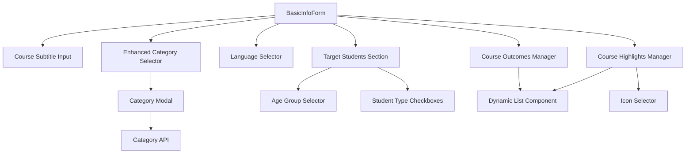
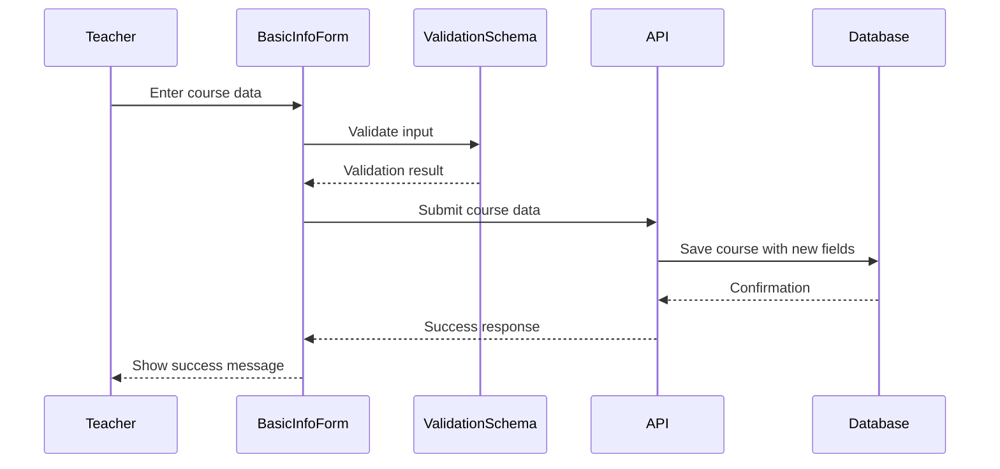

# Design Document - Course Builder Enhancements

## Overview

This design document outlines the enhancements to the existing course builder's BasicInfoForm component to include additional fields for better course organization, targeting, and presentation. The enhancements maintain backward compatibility with existing courses while providing richer metadata for new and updated courses.

## Architecture

### Component Architecture



### Data Flow



## Components and Interfaces

### 1. Enhanced BasicInfoForm Component

**Location**: `components/teacher/course-builder/BasicInfoForm.tsx`

**New State Fields**:
```typescript
interface EnhancedCourseData {
  // Existing fields
  title: string
  shortDescription: string
  fullDescription: string
  category: string
  grade: string
  subject: string
  thumbnail: string | null
  introVideo: string
  learningObjectives: string[]
  prerequisites: string[]
  difficultyLevel: string
  
  // New fields
  subtitle: string
  language: string
  ageGroups: string[]
  studentTypes: string[]
  highlights: CourseHighlight[]
  outcomes: string[]
}

interface CourseHighlight {
  text: string
  icon?: string
}
```

**New Sections**:

1. **Course Subtitle Section** (after title)
   - Single text input with character counter
   - Real-time validation for 10-150 characters
   - Helper text showing character count

2. **Enhanced Category Section** (replaces existing)
   - Dropdown with database-loaded categories
   - "Add New Category" option
   - Modal for category creation

3. **Language Selection Section** (after category)
   - Dropdown with predefined languages
   - "Other" option with text input

4. **Target Students Section** (new section after grade)
   - Age group multi-select
   - Student type checkboxes
   - Validation indicators

5. **Course Highlights Section** (after learning objectives)
   - Dynamic list with add/remove
   - Optional icon selector per highlight
   - Character counter per item

6. **Course Outcomes Section** (separate from objectives)
   - Dynamic list similar to objectives
   - Guidance text explaining difference from objectives
   - Min 3, max 8 items

### 2. Category Management Modal

**Component**: `CategoryModal.tsx`

**Purpose**: Allow teachers to create new categories on-the-fly

**Fields**:
```typescript
interface CategoryFormData {
  name: string
  description: string
  icon: File | null
  color: string
}
```

**Features**:
- Form validation
- Icon upload with preview
- Color picker
- Real-time preview of category badge
- Submit to API endpoint

### 3. Icon Selector Component

**Component**: `IconSelector.tsx`

**Purpose**: Allow selection of icons for course highlights

**Features**:
- Grid display of available icons
- Search/filter functionality
- Preview selected icon
- Common education-related icons (book, video, certificate, etc.)

### 4. Age Group Selector

**Component**: `AgeGroupSelector.tsx`

**Purpose**: Multi-select interface for age groups

**Options**:
- 3-5 years
- 6-8 years
- 9-12 years
- 13-15 years
- 16-18 years
- Adults

**Features**:
- Checkbox-based multi-select
- Visual indication of selected groups
- Validation for at least one selection

### 5. Enhanced Grade Selector

**Updates to existing grade dropdown**:

**New Options**:
- Pre-Nursery
- Nursery
- LKG
- UKG
- Grade 1-10 (existing)
- Spoken English - All Ages (conditional)
- Tuition - Custom (conditional)

**Logic**:
- Show "Spoken English - All Ages" when category is "spoken-english"
- Show "Tuition - Custom" when category is "tuition"
- Show standard grades for "online-school" category

## Data Models

### Updated Course Model

```typescript
interface Course {
  // Existing fields
  id: string
  title: string
  description: string
  category: string
  grade: string
  subject: string
  thumbnail_url: string
  intro_video_url?: string
  learning_objectives: string[]
  prerequisites: string[]
  difficulty_level: string
  instructor_id: string
  status: 'draft' | 'published' | 'archived'
  created_at: string
  updated_at: string
  
  // New fields
  subtitle: string
  language: string
  age_groups: string[]
  student_types: string[]
  highlights: {
    text: string
    icon?: string
  }[]
  outcomes: string[]
}
```

### New Category Model

```typescript
interface CourseCategory {
  id: string
  name: string
  slug: string
  description: string
  icon_url: string
  color: string
  is_active: boolean
  display_order: number
  created_at: string
  updated_at: string
}
```

### Database Schema Updates

```sql
-- Add new columns to courses table
ALTER TABLE courses 
ADD COLUMN subtitle TEXT,
ADD COLUMN language TEXT DEFAULT 'English',
ADD COLUMN age_groups TEXT[],
ADD COLUMN student_types TEXT[],
ADD COLUMN highlights JSONB DEFAULT '[]'::jsonb,
ADD COLUMN outcomes TEXT[];

-- Create course_categories table
CREATE TABLE course_categories (
  id UUID PRIMARY KEY DEFAULT uuid_generate_v4(),
  name TEXT NOT NULL UNIQUE,
  slug TEXT NOT NULL UNIQUE,
  description TEXT,
  icon_url TEXT,
  color TEXT DEFAULT '#3B82F6',
  is_active BOOLEAN DEFAULT TRUE,
  display_order INTEGER DEFAULT 0,
  created_at TIMESTAMP DEFAULT NOW(),
  updated_at TIMESTAMP DEFAULT NOW()
);

-- Create index for active categories
CREATE INDEX idx_course_categories_active ON course_categories(is_active, display_order);

-- Add trigger for updated_at
CREATE TRIGGER update_course_categories_updated_at
  BEFORE UPDATE ON course_categories
  FOR EACH ROW
  EXECUTE FUNCTION update_updated_at_column();
```

## API Endpoints

### Category Management

#### GET /api/admin/categories

**Purpose**: Retrieve all active categories

**Response**:
```typescript
{
  categories: CourseCategory[]
}
```

**Query Parameters**:
- `include_inactive`: boolean (default: false)

#### POST /api/admin/categories

**Purpose**: Create a new category

**Request Body**:
```typescript
{
  name: string
  description: string
  icon: File
  color: string
}
```

**Response**:
```typescript
{
  category: CourseCategory
}
```

**Validation**:
- Name must be unique
- Icon must be image file < 1MB
- Color must be valid hex code

#### PATCH /api/admin/categories/[id]

**Purpose**: Update existing category

**Request Body**:
```typescript
{
  name?: string
  description?: string
  icon?: File
  color?: string
  display_order?: number
}
```

#### DELETE /api/admin/categories/[id]

**Purpose**: Soft-delete category

**Response**:
```typescript
{
  success: boolean
  message: string
}
```

### Course Creation/Update

#### POST /api/teacher/courses/create

**Updated Request Body** (includes new fields):
```typescript
{
  // Existing fields...
  
  // New fields
  subtitle: string
  language: string
  ageGroups: string[]
  studentTypes: string[]
  highlights: {
    text: string
    icon?: string
  }[]
  outcomes: string[]
}
```

## Validation Schema

### Client-Side Validation (Zod)

```typescript
import { z } from 'zod'

const courseHighlightSchema = z.object({
  text: z.string().min(1).max(100),
  icon: z.string().optional()
})

const enhancedCourseBasicInfoSchema = z.object({
  // Existing validations...
  title: z.string().min(5).max(200),
  shortDescription: z.string().min(10).max(150),
  fullDescription: z.string().min(50),
  category: z.string(),
  grade: z.string(),
  subject: z.string(),
  thumbnail: z.string(),
  difficultyLevel: z.enum(['beginner', 'intermediate', 'advanced']),
  learningObjectives: z.array(z.string()).min(1),
  
  // New validations
  subtitle: z.string().min(10).max(150),
  language: z.string().min(1),
  ageGroups: z.array(z.string()).min(1),
  studentTypes: z.array(z.string()).min(1),
  highlights: z.array(courseHighlightSchema).min(3).max(10),
  outcomes: z.array(z.string()).min(3).max(8)
})
```

### Server-Side Validation

- Duplicate all client-side validations
- Additional checks:
  - Category exists and is active
  - Language is from allowed list or "Other"
  - Age groups are from predefined list
  - Student types are valid options
  - Highlight icons exist in icon library

## User Interface Design

### Layout Changes

**Before** (Current):
1. Course Title
2. Short Description
3. Full Description
4. Category / Grade / Subject (row)
5. Thumbnail
6. Intro Video
7. Difficulty Level
8. Learning Objectives
9. Prerequisites

**After** (Enhanced):
1. Course Title
2. **Course Subtitle** (NEW)
3. Short Description
4. Full Description
5. **Enhanced Category** / Grade / Subject (row)
6. **Language** (NEW)
7. Thumbnail
8. Intro Video
9. Difficulty Level
10. **Target Students Section** (NEW)
    - Age Groups
    - Student Types
11. Learning Objectives
12. **Course Highlights** (NEW)
13. **Course Outcomes** (NEW)
14. Prerequisites

### Visual Design

**Course Subtitle**:
- Lighter font weight than title
- Character counter below input
- Placeholder: "e.g., Master the fundamentals of mathematics"

**Enhanced Category**:
- Dropdown with category badges (icon + color)
- "+ Add New Category" option at bottom
- Modal with form for new category

**Language Selector**:
- Flag icons next to language names
- "Other" option with text input reveal

**Target Students**:
- Card with two subsections
- Age groups as pill-style multi-select
- Student types as large checkboxes with icons

**Course Highlights**:
- Each item has icon selector button + text input
- Visual preview of how highlights will appear
- Drag handles for reordering

**Course Outcomes**:
- Similar to objectives but with different styling
- Helper text: "What skills will students have after completing this course?"
- Checkmark icons in preview

## Error Handling

### Validation Errors

**Client-Side**:
- Real-time validation as user types
- Red border on invalid fields
- Error message below field
- Prevent form submission if invalid

**Server-Side**:
- Return 400 with detailed error messages
- Map errors to specific fields
- Display errors in toast notification

### API Errors

**Category Creation**:
- Duplicate name: "A category with this name already exists"
- Invalid icon: "Please upload a valid image file under 1MB"
- Network error: "Failed to create category. Please try again."

**Course Submission**:
- Missing required fields: Field-specific error messages
- Invalid data format: "Please check your input and try again"
- Database error: "Failed to save course. Please try again."

## Testing Strategy

### Unit Tests

**Component Tests**:
- BasicInfoForm renders all new fields
- Subtitle character counter updates correctly
- Category modal opens and closes
- Age group selection validates minimum
- Student type requires at least one
- Highlights enforce min/max limits
- Outcomes enforce min/max limits

**Validation Tests**:
- Subtitle length validation (10-150 chars)
- Language selection validation
- Age groups minimum 1 selection
- Student types minimum 1 selection
- Highlights array length (3-10)
- Outcomes array length (3-8)

### Integration Tests

**Form Submission**:
- Complete form with all new fields submits successfully
- Validation errors prevent submission
- API errors display correctly
- Success redirects to next step

**Category Management**:
- Create new category from modal
- New category appears in dropdown immediately
- Category with duplicate name shows error
- Icon upload works correctly

### End-to-End Tests

**Course Creation Flow**:
1. Teacher opens course builder
2. Fills in all basic info including new fields
3. Creates new category via modal
4. Selects multiple age groups
5. Adds course highlights with icons
6. Adds course outcomes
7. Submits form successfully
8. Verifies data saved correctly

## Performance Considerations

### Optimization Strategies

**Category Loading**:
- Cache categories in React Query
- Invalidate cache on category creation
- Prefetch categories on page load

**Icon Library**:
- Lazy load icon selector component
- Use SVG sprites for icons
- Cache icon selections

**Form State**:
- Debounce validation checks
- Use React.memo for list items
- Optimize re-renders with useCallback

**Image Uploads**:
- Client-side image compression
- Progress indicators for uploads
- Thumbnail generation

## Security Considerations

### Input Validation

- Sanitize all text inputs
- Validate file uploads (type, size)
- Prevent XSS in user-generated content
- Rate limit API endpoints

### Authorization

- Verify teacher role for course creation
- Verify admin role for category management
- Check course ownership for updates
- Validate category exists and is active

### Data Protection

- Encrypt sensitive data at rest
- Use HTTPS for all API calls
- Implement CSRF protection
- Sanitize database queries

## Migration Strategy

### Backward Compatibility

**Existing Courses**:
- All new fields are optional in database
- Default values provided for new fields
- Existing courses display without new fields
- Teachers can update courses to add new fields

**Migration Steps**:
1. Add new columns with default values
2. Create course_categories table
3. Seed initial categories from existing data
4. Update API endpoints
5. Deploy frontend changes
6. Monitor for errors

### Data Migration

```sql
-- Migrate existing categories to new table
INSERT INTO course_categories (name, slug, is_active, display_order)
SELECT DISTINCT 
  category,
  LOWER(REPLACE(category, ' ', '-')),
  true,
  ROW_NUMBER() OVER (ORDER BY category)
FROM courses
WHERE category IS NOT NULL;

-- Set default language for existing courses
UPDATE courses 
SET language = 'English' 
WHERE language IS NULL;

-- Initialize empty arrays for new fields
UPDATE courses 
SET 
  age_groups = ARRAY[]::TEXT[],
  student_types = ARRAY[]::TEXT[],
  highlights = '[]'::jsonb,
  outcomes = ARRAY[]::TEXT[]
WHERE age_groups IS NULL;
```

## Rollout Plan

### Phase 1: Database & API (Week 1)
- Create database migrations
- Implement category management API
- Update course creation API
- Write API tests

### Phase 2: Components (Week 2)
- Update BasicInfoForm component
- Create CategoryModal component
- Create IconSelector component
- Create AgeGroupSelector component
- Write component tests

### Phase 3: Integration (Week 3)
- Integrate all components
- Update validation schemas
- Implement error handling
- Write integration tests

### Phase 4: Testing & Deployment (Week 4)
- End-to-end testing
- Performance testing
- Security audit
- Deploy to production
- Monitor for issues

## Success Metrics

### Adoption Metrics
- % of new courses using new fields
- % of teachers creating custom categories
- Average number of highlights per course
- Average number of outcomes per course

### Quality Metrics
- Course completion rates (before/after)
- Student satisfaction scores
- Course discovery improvements
- Search relevance improvements

### Technical Metrics
- API response times
- Form submission success rate
- Error rates
- Page load times
